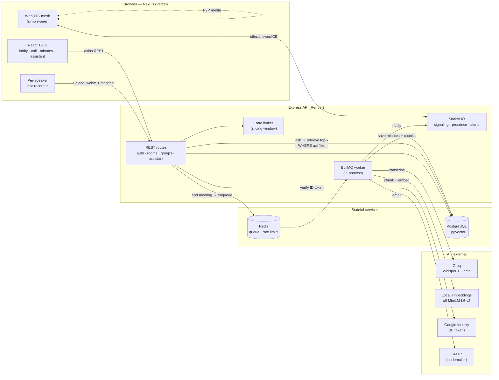

# MeetAI

**AI-powered meeting assistant** — HD WebRTC video calls that transcribe themselves, generate speaker-attributed minutes, action items, and titles, and let you **ask questions across every meeting you've had** with citations that deep-link back to the source.

MeetAI is a full-stack monorepo built to exercise real distributed-systems and AI-engineering techniques end to end: a durable, idempotent job queue for the AI pipeline; retrieval-augmented generation with permission-filtered vector search; per-speaker audio capture merged server-side into a single attributed transcript; and a hardened auth stack (OTP, Google Sign-In, JWT rotation-ready refresh, sliding-window rate limiting).

> Two deep-dive write-ups accompany the flagships: [the durable minutes job queue](docs/understanding/flagship-a-job-queue.md) and [cross-meeting RAG](docs/understanding/flagship-b-rag.md).

---

## Highlights

- **WebRTC mesh video** with a pre-join lobby (mic/camera/device selection before you enter), socket.io signaling, and TURN-ready NAT traversal.
- **Per-speaker audio capture** — each client records its own mic track with a manifest (speaker + start offset); the server merges tracks into one **speaker-attributed** timeline instead of one muddy mixed recording.
- **Durable AI minutes pipeline** — Whisper transcription → LLM summary + action items + generated title → Postgres → members notified by socket event and email. Runs on a **BullMQ queue** with idempotent, exponentially backed-off retries and graceful shutdown, so minutes survive crashes and deploys.
- **Ask across all meetings (RAG)** — group-wide *and* a personal ChatGPT-style assistant with saved chat threads, answered by vector retrieval over every transcript you're allowed to see, with citation chips that open the exact meeting.
- **Minutes for group *and* standalone meetings**, each with per-meeting Ask-AI grounded in that transcript.
- **Auth** — OTP email verification, password reset, JWT access (15 m) + refresh (15 d), **Google Sign-In**, and **Redis sliding-window rate limiting** on auth and LLM endpoints.
- **Deterministic AI test harness** — `AI_STUB=1` makes the whole pipeline testable offline, with no Groq calls and no cost.

---

## Architecture



**The two flagships compose:** the same BullMQ worker that durably generates minutes also chunks the transcript and writes embeddings, so cross-meeting search is populated as a side effect of the pipeline it depends on.

---

## Tech stack

| Layer | Choices |
|---|---|
| **Frontend** | Next.js 16, React 19, TypeScript, Tailwind CSS v4, axios, socket.io-client, simple-peer, react-markdown |
| **Backend** | Node.js, Express 5, TypeScript (ts-node ESM), Prisma 5 |
| **Data** | PostgreSQL + **pgvector** (Prisma Postgres in prod; Postgres 16 via Docker locally), Redis 7 |
| **Queue** | BullMQ (ioredis) — durable minutes pipeline |
| **AI** | Groq (Whisper transcription, Llama summarization / action items / Q&A), `@huggingface/transformers` running `all-MiniLM-L6-v2` locally (384-dim embeddings, no API key) |
| **Realtime** | Socket.IO (signaling, presence, "meeting started" alerts), WebRTC mesh |
| **Auth** | JWT (access + refresh), bcrypt, OTP email, Google Identity Services (`google-auth-library`), sliding-window rate limiting |
| **Deploy** | Vercel (web) + Render (API), cross-site aware |

---

## System-design decisions (decision → tradeoff)

Each is written the way it should be defended in an interview — the choice *and* what it costs.

- **Job queue over fire-and-forget.** Ending a meeting used to `void processMeetingMinutes(...)` — a 30–60 s pipeline that died silently on any deploy/crash. It now enqueues a BullMQ job and returns **202 Accepted**. *Tradeoff:* one new piece of infra (Redis) and eventual-consistency UX (a "generating…" state) in exchange for durability, retries, and producer/consumer decoupling.
- **At-least-once + idempotency, not exactly-once.** `jobId = roomId` de-dupes double-submits; the worker also checks "minutes already exist for this room" before inserting, and emails send only on first creation. *Tradeoff:* exactly-once doesn't exist end-to-end, so the practical substitute is safe-to-repeat handlers keyed on natural IDs.
- **Retrieval ACL lives in the SQL `WHERE`, never the prompt.** Cross-meeting search filters `group_id`/ownership *inside* the vector query, so the model physically never sees chunks you can't access. *Tradeoff:* none worth trading — prompt-level "please don't leak" is how RAG systems leak.
- **pgvector, not a dedicated vector DB.** Chunks live in the same Postgres as the minutes → transactional consistency, one backup story, and the permission filter is a plain join. *Tradeoff:* a Pinecone-class system wins at millions of vectors / high QPS; at thousands of chunks that's unused complexity.
- **Local embeddings (MiniLM) over a paid embedding API.** 384-dim vectors generated in-process — free, offline, no key, and stub-able for tests. *Tradeoff:* lower ceiling than large hosted models; fine for this corpus and it keeps the test harness deterministic.
- **Sliding-window rate limiting, hand-rolled, fail-open.** A Redis sorted-set window (`ZADD`/`ZREMRANGEBYSCORE`/`ZCARD` in one `MULTI`) caps login/OTP per IP and LLM `/ask` per user; on a Redis outage it **calls `next()`**. *Tradeoff:* availability over strictness — a Redis blip must not lock everyone out of login. Fixed windows were rejected for their 2× burst at boundaries.
- **Google Sign-In via ID-token flow.** The browser gets a signed ID token from Google's button; the server verifies it (`verifyIdToken`, audience-checked) and mints *our own* tokens. *Tradeoff:* no redirect/callback plumbing and nothing else in the auth model changes; requires the client id on both sides and origins registered in the Google console.
- **Bearer refresh token in the cross-site deploy.** Web (Vercel) and API (Render) are different sites, so the httpOnly refresh cookie is third-party and browsers block it; the refresh token is also sent in the request body. *Tradeoff:* a 15-day token in `localStorage` is XSS-exposable — accepted for this project; the most-secure alternative is a same-origin proxy.
- **Per-speaker capture + server-side merge, not one mixed track.** Each client records its own mic and uploads a manifest; the server interleaves tracks by start offset into a speaker-attributed transcript. *Tradeoff:* more upload/merge complexity for dramatically better transcripts and correct attribution.
- **WebRTC mesh, not an SFU.** Every peer sends to every peer — zero media-server ops. *Tradeoff:* O(n²) upload streams that hurt past ~4–5 participants; the migration point (LiveKit/mediasoup) is known and deliberate.
- **Graceful shutdown.** On `SIGTERM` the server stops accepting connections, lets the in-flight minutes job finish (`worker.close()`), then exits — with a watchdog inside Render's kill window. *Tradeoff:* a few seconds of drain time vs. "deploys lose data."

---

## Repository layout

```
apps/
  web/                 Next.js frontend (App Router)
    app/(auth)/        login / register / forgot — shared auth-form + Google button
    app/room/          call UI, pre-join lobby, single-meeting minutes
    app/groups/        group dashboard, members, minutes, "ask across meetings"
    app/assistant/     personal RAG assistant with saved chat threads
    components/        AppHeader, ChatMarkdown, GoogleSignInButton, MinutesModal, …
    hooks/             useLocalStream, useWebRTC, useMeetingRecorder, alerts
  server/
    routes/            auth
    src/routes/        rooms, groups, assistant
    src/queue/         BullMQ connection, queue, worker  (Flagship A)
    src/services/      transcription, summarization, action items, embeddings,
                       chunking, RAG retrieval, Q&A            (Flagship B)
    middleware/        authMiddleware, rateLimit
    prisma/            schema + hand-written SQL migrations
    test/              AI_STUB deterministic end-to-end suite
docs/understanding/    flagship deep-dives
docker-compose.yml     local Postgres 16 + Redis 7
```

---

## Local setup

**Prerequisites:** Node 20+, Docker (for Postgres + Redis), a [Groq API key](https://console.groq.com) (free).

```bash
# 1. Infra — Postgres 16 (:5432) + Redis 7 (:6379)
docker compose up -d

# 2. Backend
cd apps/server
npm install
cp .env.example .env          # then fill in the values (see table below)
npm run prisma:deploy         # apply migrations (installs pgvector + schema)
npm run prisma:generate
npm run dev                   # → http://localhost:4000

# 3. Frontend (new terminal)
cd apps/web
npm install
# create .env.local with NEXT_PUBLIC_SERVER_URL / NEXT_PUBLIC_WS_URL
npm run dev                   # → http://localhost:3000
```

**Run the tests** (offline, deterministic — no Groq calls, rate limiting auto-disabled):

```bash
cd apps/server && npm test
```

---

## Environment variables

**`apps/server/.env`**

| Name | Purpose |
|---|---|
| `PORT` | API port (e.g. `4000`) |
| `DATABASE_URL` | PostgreSQL connection string (pgvector-enabled) |
| `JWT_SECRET` / `JWT_REFRESH_SECRET` | Access / refresh token signing secrets |
| `CLIENT_URL` | Exact web origin for CORS (no trailing slash) |
| `REDIS_URL` | Redis for the queue + rate limits (`rediss://` in prod for TLS) |
| `GROQ_API_KEY` | Whisper transcription + Llama summarization/Q&A |
| `GOOGLE_CLIENT_ID` | Google OAuth Web client id (verifies Sign-In ID tokens) |
| `SMTP_HOST` / `SMTP_PORT` / `SMTP_USER` / `SMTP_PASS` / `SMTP_FROM` | OTP + "minutes ready" email |
| `NODE_ENV` | `development` / `production` (`test` disables rate limiting) |

**`apps/web/.env.local`**

| Name | Purpose |
|---|---|
| `NEXT_PUBLIC_SERVER_URL` | API base URL for REST (axios) |
| `NEXT_PUBLIC_WS_URL` | Socket.IO URL — same origin as the API, separate var by design |
| `NEXT_PUBLIC_GOOGLE_CLIENT_ID` | Same Google client id (renders the Sign-In button) |

---

## What I'd build next (deliberately not built)

Knowing the migration point matters as much as building it:

- **Refresh-token rotation + reuse detection** — `jti`/`familyId` in Redis; replaying a used token kills the whole family. Bounds the blast radius of a leaked long-lived token.
- **Socket.IO Redis adapter + Redis-backed presence** — presence currently lives in in-memory Maps on a single instance; moving it to Redis unlocks multi-instance scale-out.
- **SFU (LiveKit / mediasoup)** — once mesh's O(n²) upload streams hurt past ~4–5 participants.
- **Object storage + presigned uploads** for audio, instead of local disk on the API instance.
- **CI (GitHub Actions)** running the `AI_STUB` suite + `tsc` + `next build`, structured logging with cross-service request IDs, and a dependency-checking `/health` endpoint.

---

## License

Personal portfolio project.
